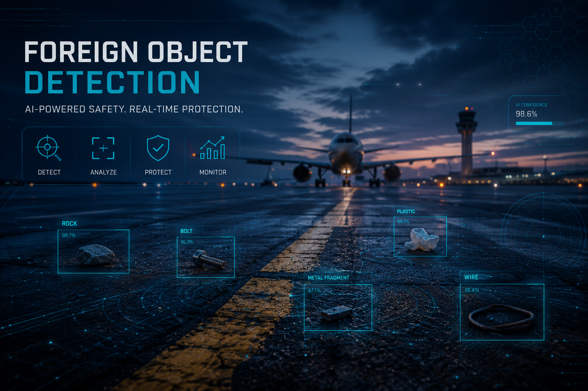

# 🛡️ AeroGuard Autonomous Security OS

## 🎯 Overview
* AeroGuard Autonomous Security OS is an enterprise-grade AI-powered Autonomous Ground Vehicle (AGV) platform designed for airport runways, tarmacs, cargo zones, and other safety-critical environments. By combining real-time Computer Vision, autonomous navigation logic, Large Language Models, and Neural Voice Synthesis, AeroGuard acts as an intelligent patrol and hazard-response system capable of reducing manual inspection workload and minimizing operational risk.
* The mission of AeroGuard is to enhance airside safety through continuous autonomous monitoring, rapid hazard detection, explainable decision-making, and human-friendly voice interaction.
---
### ✨ Key Enterprise Features
* 🔍 AI-Powered Foreign Object Detection (FOD)
Utilizes YOLOv8 Nano for real-time detection of runway debris, misplaced baggage, equipment, and safety hazards.
Processes live camera feeds with low-latency inference suitable for edge deployment.
Helps prevent Foreign Object Damage (FOD), one of the leading causes of operational and maintenance incidents in aviation environments.
---
* 🧠 Autonomous Navigation & Collision Avoidance
Implements a 3-Zone Spatial Awareness System for dynamic obstacle assessment.
Continuously evaluates nearby objects and environmental risks.
Automatically overrides standard navigation behavior to:
Reroute around obstacles.
Slow movement in high-risk zones.
Trigger emergency braking when required.
---
* 🗣️ Natural Language Command Center
Powered by Groq-hosted LLaMA 3.1 8B for ultra-fast language understanding.
Eliminates rigid keyword-based controls.
Supports conversational commands for rover operations, status requests, and mission control workflows.
---
* 🔊 Neural Voice Feedback System
Uses Edge-TTS to generate natural-sounding audio responses.
Delivers real-time warnings, operational alerts, and system status updates.
Enables intuitive human-machine interaction in noisy operational environments
---
* 📡 Live Telemetry & Monitoring Dashboard
Built with Streamlit for rapid operational visibility.
Displays:
* Live GPS coordinates
* Battery health metrics
* AI confidence scores
* Obstacle proximity indicators
* Dynamic radar visualization
* Provides a centralized command interface for operators and supervisors.
---
* ⚡ Multi-Threaded Real-Time Architecture
* Computer Vision and Voice Intelligence operate independently.
* Thread-safe communication ensures smooth synchronization between subsystems.
* Prevents UI freezes, frame drops, and command-processing bottlenecks.
---
## 🏗️ System Architecture
* 👁️ Vision Engine (Perception Layer)
OpenCV captures live video streams.
YOLOv8 identifies objects and hazards.
Navigation logic calculates obstacle proximity, risk levels, and radar positioning.
Decision layer determines avoidance or braking actions.
* 🧠 Intelligence Engine (Decision Layer)
SpeechRecognition captures operator voice input.
Commands are processed through Groq LLaMA 3.1 8B.
Structured responses determine rover behavior and mission execution.
* 🔊 Communication Engine (Interaction Layer)
Edge-TTS converts AI responses into spoken feedback.
Critical alerts are announced automatically.
Operators receive immediate audible confirmation of system actions.
* 🗄️ State Management Layer
Shared state maintained through thread-safe Python queues.
Synchronizes telemetry, vision data, command processing, and dashboard updates.
Ensures consistent system behavior under concurrent workloads.
---
# 🛠️ Technology Stack
* Frontend & Interface
* Python
* Streamlit
* HTML/CSS
* AI & Computer Vision
* YOLOv8 Nano
* OpenCV
* NumPy
* Natural Language Processing
* Groq API
* LLaMA 3.1 8B
* Speech Systems
* SpeechRecognition
* Edge-TTS
* System Integration
* Multi-threading
* Queue-based State Management
---
# 🚀 Local Installation & Setup
1. Clone the Repository
```bash
git clone https://github.com/Ronit-0/AeroGuard-Capstone.git
cd AeroGuard-Capstone
```
2. Install Dependencies
```bash
pip install -r requirements.txt
```
3. Download the test videos from google drive
[Videos Folder](https://drive.google.com/drive/folders/1hFhZonQy5Pkk9N3qwhrblEA-Vc0aRVl2?usp=sharing)
Make sure all the files are in same folder

4. Then in terminal run
```
python 8_phase3_remastered.py
```

---
# 🎓 Project Information
* Project Type: Final Year Capstone Project
* Institution: National Skill Training Institute (NSTI), Howrah
* Development Team -
1. Puskar Mondal
2. Ronit Das
3. Poulymi Samanta
4. Jayanti Jana
---
# ⚠️ Operational Disclaimer
AeroGuard is currently a software simulation and architectural proof-of-concept for autonomous airside safety operations. While the platform demonstrates real-time hazard detection, collision avoidance, and AI-assisted control workflows, physical deployment requires additional hardware integration, safety certification, and regulatory compliance testing.
This system should not be used as a standalone safety authority in live aviation environments without appropriate validation, supervision, and certification procedures.
